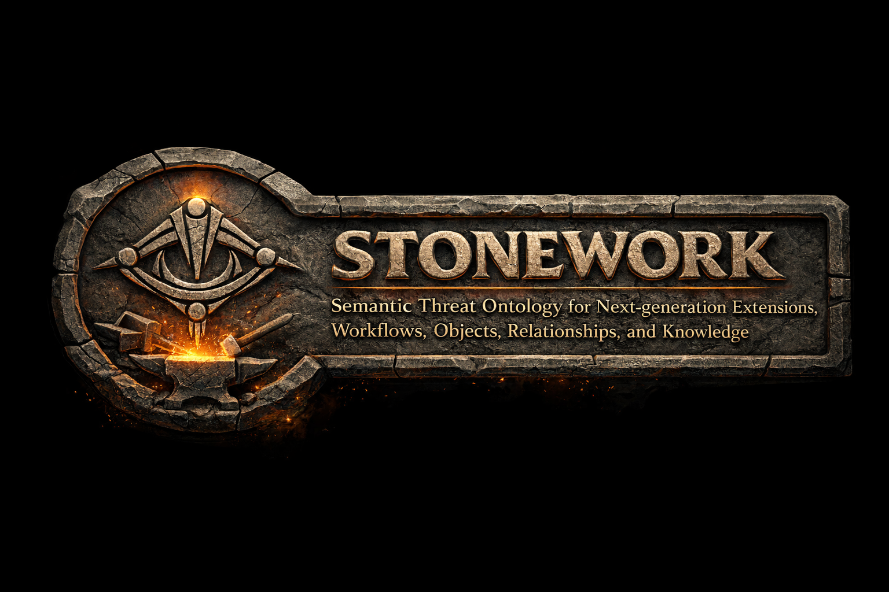

# STONEWORK — Semantic Threat Ontology for Next-generation Extensions, Workflows, Objects, Relationships, and Knowledge

**STONEWORK is an OWL 2 extension of STONES that adds what STIX 2.1 does not define.**

[STONES](https://github.com/Cyber-Terrain-Ontology/stones) provides a faithful ontological binding of STIX 2.1. STONEWORK imports STONES and extends the cyber terrain to cover adversary techniques, software weaknesses, and defensive controls — drawing from MITRE ATT&CK, MITRE D3FEND, CWE, NIST SP 800-53, and CIS Critical Controls. Together, STONES and STONEWORK form a composable semantic stack for AI-driven cyber threat intelligence analysis.

STONEWORK is independent work. It is not affiliated with OASIS, MITRE, NIST, or CIS.

> STONEWORK is a candidate ontology for the **Cyber Ontology Foundry**, announced at STIDS 2026.

---

## What STONEWORK adds

STONEWORK extends STONES across four concrete domains:

| Domain | Sources |
|---|---|
| Adversary techniques (TTPs) | MITRE ATT&CK, MITRE D3FEND |
| Software weaknesses | CWE (Common Weakness Enumeration) |
| Defensive controls | NIST SP 800-53, CIS Critical Controls |
| Vulnerability linkage | Connects CVE → CWE → ATT&CK technique → control |

This coverage enables queries that no single standard can answer on its own. A SPARQL query can trace a CVE to the weakness it exploits, to the attack patterns that leverage that weakness, to the APT groups known to use them, and to the controls that mitigate the risk — in a single federated query.

---

## Quick Start — Using the Ontology

### 1. Download

Download the STONEWORK ontology file:

```
ontologies/stonework.ttl
```

STONEWORK imports STONES. Load both into your triplestore, or clone with submodules (see Developer Setup) to get everything together.

### 2. Load into a triplestore

Load both `stones-merged.ttl` (from the STONES repo) and `stonework.ttl` into any OWL-compatible triplestore:
[AllegroGraph](https://allegrograph.com) · [Stardog](https://stardog.com) · [GraphDB](https://graphdb.ontotext.com) · [Apache Jena / Fuseki](https://jena.apache.org)

### 3. Verify with SPARQL

```sparql
PREFIX stonework: <https://cyberterrain.org/ns/stonework#>
PREFIX owl:       <http://www.w3.org/2002/07/owl#>
PREFIX rdfs:      <http://www.w3.org/2000/01/rdf-schema#>

SELECT ?class ?label WHERE {
  ?class a owl:Class ;
         rdfs:label ?label .
}
ORDER BY ?label
```

### 4. Try the worked example

Load the CTI reference datasets (ATT&CK, CAPEC, CVE, CWE, NIST SP 800-53, CIS) and run the Log4Shell chain query: from a vulnerable product to a threat actor to a defensive control in a single SPARQL query. Full walkthrough at [cyberterrain.org](https://cyberterrain.org).

---

## Developer Setup

### Clone with submodules

STONEWORK includes STONES as a submodule.

```bash
git clone --recurse-submodules https://github.com/Cyber-Terrain-Ontology/stonework.git
cd stonework
```

If you already cloned without `--recurse-submodules`:

```bash
git submodule update --init --recursive
```

### Activate the pre-commit hook

Run once after cloning to enable the pre-commit hook (strips Protégé's default prefix from `.ttl` files and keeps the ontology catalog read-only):

```bash
git config core.hooksPath .githooks
```

---

## Documentation

| Resource | URL |
|---|---|
| Website | [cyberterrain.org](https://cyberterrain.org) |
| Ontology reference (WIDOCO) | [cyberterrain.org/ns/stonework/doc](https://cyberterrain.org/ns/stonework/doc/) |
| Namespace | `https://cyberterrain.org/ns/stonework#` |
| Base ontology | [STONES](https://github.com/Cyber-Terrain-Ontology/stones) |

---

## Ecosystem

**STONES + STONEWORK** form a composable semantic stack for AI-driven CTI analysis:

- **STONES** — faithful OWL 2 binding of STIX 2.1
- **STONEWORK** — extends STONES with ATT&CK, D3FEND, CWE, NIST SP 800-53, and CIS *(this repository)*

STONEWORK is also imported by [gistCyber](https://github.com/semanticarts/gistCyber) (Semantic Arts), integrating it into the gist enterprise ontology stack.

Both ontologies are candidate submissions to the **Cyber Ontology Foundry**, alongside MITRE's D3FEND Framework Ontology.

---

## License

STONEWORK is released under the **MIT License** — free to use, extend, and integrate in both open-source and commercial environments. See [LICENSE](LICENSE) for full terms.
