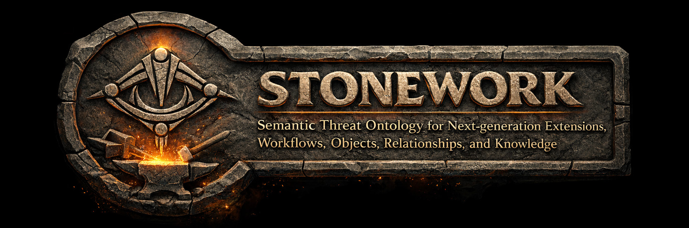

**STONEWORK** *(Semantic Threat Ontology for Next-generation Extensions, Workflows, Objects, Relationships, and Knowledge)* **is an OWL 2 cyber ontology for reasoning across threats, weaknesses, controls, assets, and evidence.**

The ontology provides a shared semantic layer for threats, weaknesses, defenses, assets, events, observables, financial activity, and evidence-bearing relationships. It is designed to connect operational CTI, defensive engineering, cyber-physical systems, and risk/control evidence without making any single source framework the center of the model.

STONEWORK's goals are to:

- provide a lightweight core vocabulary with stable identifiers for cyber reasoning;
- align source frameworks as composable peer graphs rather than copying or replacing them;
- support cross-framework queries that connect vulnerabilities, weaknesses, attack patterns, actors, assets, events, and controls;
- give AI-assisted analysis a typed, provenance-aware knowledge model that can be extended for local missions and data sources.

> STONEWORK is a candidate ontology for the **[Cyber Ontology Foundry](https://ncor-network.org/docs/research/cyber-ontology-foundry)**, announced at STIDS 2026.

---

## What STONEWORK covers

STONEWORK organizes cyber knowledge across linked domains that commonly appear in threat intelligence, defensive engineering, cyber-physical systems, and risk analysis:

| Domain | Sources |
|---|---|
| Adversary techniques (TTPs) | MITRE ATT&CK, MITRE ATT&CK for ICS, MITRE D3FEND |
| Software weaknesses | CWE (Common Weakness Enumeration) |
| Defensive controls | NIST SP 800-53, CIS Critical Controls |
| Cyber-physical / OT assets | MITRE D3FEND PhysicalArtifact, MITRE EMB3D device properties |
| Vulnerability linkage | Connects CVE → CWE → ATT&CK technique → control |
| Event and observable alignment | OCSF, UCO, STIX/STONES |
| Financial observables | Accounts, transactions, monetary amounts, crypto assets, and laundering typologies |

This coverage enables queries that no single standard can answer on its own. A SPARQL query can trace a CVE to the weakness it exploits, to the attack patterns that leverage that weakness, to the APT groups known to use them, and to the controls that mitigate the risk — in a single federated query.

Both NIST SP 800-53 and CIS Controls now carry real, materialized `stonework:mitigatesAttackPattern` links to ATT&CK — not just conceptual coverage. NIST's crosswalk is sourced from the Center for Threat-Informed Defense's mapping, since NIST's own catalog defines no ATT&CK relationship on its own.

---

## Framework composition and extensibility

STONEWORK provides its own stable namespace and core model, then composes with controlled vocabularies, source-framework alignments, and local extensions as needed. The core remains lightweight; import-only profiles add the framework mappings needed for a particular use case without forcing consumers to load every adapter.

[STONES](https://github.com/Cyber-Terrain-Ontology/stones) can be used as STONEWORK's extensible STIX 2.1 framework adapter when faithful STIX interchange is required. STONEWORK is not defined as an extension of STONES; STONES, ATT&CK, D3FEND, EMB3D, CWE, NIST SP 800-53, CIS Critical Controls, OCSF, UCO, FATF, and other framework modules are peer vocabularies that can be loaded alongside STONEWORK.

STONEWORK is independent work. It is not affiliated with OASIS, MITRE, NIST, or CIS.

---

## Status

**Active Development**

The namespace (`https://cyberterrain.org/ns/stonework#`) is stable and will not change. Core vocabulary is in place. Framework coverage (ATT&CK, D3FEND, EMB3D, CWE, NIST SP 800-53, CIS, BFO 2020, OCSF, UCO, FATF, and STIX/STONES) is expanding. The scope of coverage will grow as the ontology matures. Feedback, issues, and contributions are welcome.

---

## Quick Start — Using the Ontology

### 1. Download

Choose the smallest ontology entry point that fits the use case:

```
ontologies/stonework.ttl                         # core vocabulary only
ontologies/profiles/stonework-stix.ttl           # core + categories + STIX mapping
ontologies/profiles/stonework-full.ttl           # all bundled mappings
```

STONEWORK treats STONES and other CTI framework ontologies (ATT&CK, D3FEND, CAPEC, CWE, CVE, CPE, OCSF, UCO, ...) as peer reference vocabularies. The profile ontologies declare a dependable import closure without adding vocabulary of their own. External framework datasets remain separately loadable peer graphs.

### 2. Load into a triplestore

Load the selected entry point and any external source datasets, such as `stones-merged.ttl` from the STONES repo, into an OWL-compatible triplestore:
[AllegroGraph](https://allegrograph.com) · [Stardog](https://stardog.com) · [GraphDB](https://graphdb.ontotext.com) · [Apache Jena / Fuseki](https://jena.apache.org)

### 3. Verify with SPARQL

```sparql
PREFIX stonework: <https://cyberterrain.org/ns/stonework#>
PREFIX owl:       <http://www.w3.org/2002/07/owl#>
PREFIX rdfs:      <http://www.w3.org/2000/01/rdf-schema#>

SELECT ?class ?label WHERE {
  ?class a owl:Class ;
         rdfs:label ?label .
}
ORDER BY ?label
```

### 4. Try the worked example

Load the CTI reference datasets (ATT&CK, CAPEC, CVE, CWE, NIST SP 800-53, CIS) and run the Log4Shell chain query: from a vulnerable product to a threat actor to a defensive control in a single SPARQL query. Full walkthrough at [cyberterrain.org](https://cyberterrain.org).

---

## Modeling convention: OWL classes and SKOS concepts

Use an OWL class for an intrinsic kind of thing whose instances should participate in class reasoning—for example, `stonework:Malware`, `stonework:ThreatActor`, or `stonework:Vulnerability`. Use a SKOS concept for a controlled vocabulary value that classifies or qualifies something—for example, `stonework:Ransomware`, a named individual of `stonework:MalwareType`. A ransomware sample is categorized by that concept; the concept is not an OWL subclass of Malware.

`stonework:categoryScheme` is the umbrella scheme for every STONEWORK category. Narrower schemes such as `stonework:malwareTypeScheme`, `stonework:incidentStatusScheme`, and `stonework:threatActorRoleScheme` organize individual vocabularies. Vocabulary values explicitly assert `rdf:type skos:Concept` plus both umbrella and vocabulary-specific `skos:inScheme` membership, so plain RDF and SKOS clients can discover them without reasoning. Matching OWL value restrictions on each category subclass keep extensions semantically consistent without treating a vocabulary class as a SKOS concept.

Every controlled-vocabulary class, scheme, and canonical value has exactly one English `skos:prefLabel` and `skos:definition`; additional languages may be supplied. Every value in a specific scheme also carries exactly one language-neutral `skos:notation`, unique within that scheme. Use the notation as the stable wire identifier and the preferred label for human-facing text.

Schemes derived from an external standard declare an IRI-valued `dcterms:source` on the scheme itself. The source records provenance; it does not assert that every STONEWORK extension is defined by, or exactly equivalent to, the cited standard.

```turtle
ex:sample-1
    a stonework:MalwareSample ;
    stonework:categorizedBy stonework:Ransomware .

stonework:Ransomware
    a stonework:MalwareType ;
    skos:notation "ransomware" .
```

### SOSA-inspired observation and actuation

STONEWORK distinguishes a persistent safeguard specification from the deployed mechanism and the activity that applies it. A `stonework:Countermeasure` describes the rule, control, or mitigation; a `stonework:SecurityActuator` is the deployed infrastructure capable of applying it; and a `stonework:SecurityActuation` records a particular application. This mirrors the SOSA actuator/actuation pattern without formally importing SOSA. Systems such as IPS and EDR platforms may be both sensors and actuators.

`stonework:Actuator` is a different class: a physical plant or process device (valve, motor, relay) that subclasses `stonework:PhysicalArtifact`. Do not conflate it with `SecurityActuator`. ICS and OT assets live under `PhysicalArtifact`; a device that also runs processes and participates in networks may additionally be typed as `stonework:Host`. EMB3D device properties, threats, and mitigations live in `ontologies/frameworks/emb3d.ttl`, not in core.

```turtle
ex:edr-agent
    a stonework:SecurityActuator ;
    stonework:implementsCountermeasure ex:isolate-host-rule .

ex:isolation-2026-08-21
    a stonework:SecurityActuation ;
    stonework:madeByActuator ex:edr-agent ;
    stonework:appliesCountermeasure ex:isolate-host-rule ;
    stonework:actsOn ex:compromised-host .
```

---

## Developer Setup

### Clone the repo

```bash
git clone https://github.com/Cyber-Terrain-Ontology/stonework.git
cd stonework
```

### Activate the pre-commit hook

Run these two commands once after cloning:

```bash
git config core.hooksPath .githooks
bash tools/download-rdf-toolkit.sh
bash tools/install-shacl-validator.sh
```

The first command activates the hooks tracked in `.githooks/`. The second downloads the [edmcouncil rdf-toolkit](https://github.com/edmcouncil/rdf-toolkit) jar (~33 MB, gitignored) used to canonicalize Turtle files on every commit. The third builds the pinned [`shacl-cli`](https://crates.io/crates/shacl-cli) SHACL engine into `tools/bin/` (gitignored, ~30 s, requires `cargo`).

Run the ontology checks directly at any time with:

```bash
bash .githooks/format-ttl.sh --check
python3 tools/check-ontology.py
python3 tools/check-shacl.py
```

The first command verifies canonical Turtle formatting without modifying files. The second parses every Turtle file and checks high-value OWL integrity rules. The third composes the SHACL shape graphs in `ontologies/shapes/` into named validation profiles and runs them against the repository's test fixtures with the pinned [`shacl-cli`](https://crates.io/crates/shacl-cli) engine. CI runs all three checks for every pull request.

The SHACL files are optional application-level data-quality profiles; they do not change STONEWORK's open-world OWL semantics and are not part of the core, STIX, or full-profile import closure. **The shapes are a validation profile, not the interoperability contract** — the contract is the ontology, and a record can be a legitimate instance of STONEWORK while still failing a shape a particular consumer cares about. Shape graphs compose: `stonework-shapes.ttl` carries source-independent value-domain rules, `frameworks/financial-shapes.ttl` carries the financial adapter contract, and `stonework-strict-shapes.ttl` adds the normalized-provenance demand on top of the core profile. Findings are tiered by `sh:severity`: `sh:Violation` means the data is malformed and gates the build, while `sh:Warning` means the data is merely incomplete (an unresolved cross-reference, a partial mapping) and is reported without failing. Shape graphs never use `sh:closed`, which the checker enforces. Existing ingest pipelines are unaffected unless they deliberately load the shapes into a SHACL-aware engine and invoke validation. See [`docs/shacl.md`](docs/shacl.md).

**What the hook does on each commit:**
- Canonicalizes all staged `.ttl` files via rdf-toolkit (alphabetical prefixes, tab indentation, consistent triple ordering) so diffs reflect content changes, not style noise
- Strips Protégé's injected default `:` prefix when present
- Parses every Turtle file and rejects common OWL integrity errors, including accidental domain/range intersections, incompatible inverse-property endpoints, property-kind collisions, class/individual punning, conflicting definitions, duplicate controlled-vocabulary labels, unresolved imports, inconsistent version metadata, and incomplete category-scheme declarations
- Sets `ontologies/catalog-v001.xml` read-only so Protégé cannot overwrite it

**Requirements:** Java 11+ and Python 3 on `PATH`. The SHACL checks additionally need `cargo` ([rustup](https://rustup.rs)) to build the engine once.

### Ontology imports and versions

Import the stable ontology IRI, such as `https://cyberterrain.org/ns/frameworks/cve`. Each ontology also declares an `owl:versionIRI` for consumers that need to pin an exact vocabulary release. The local XML catalog resolves both forms. Every bundled framework module imports the STONEWORK core directly and declares any additional bundled dependency, so a module can be loaded independently as well as through a profile.

### Single-file merge for publication

`ontologies/stonework.ttl` (core) and `ontologies/categories.ttl` (Category/Role subclasses, SKOS concept schemes, and the controlled-vocabulary individuals) are kept separate so the core loads without the full vocabulary set. A client that dereferences the namespace IRI, however, expects every `stonework:` term in one document.

```bash
bash tools/build-merged.sh              # -> build/stonework-merged.ttl (gitignored)
```

This concatenates the two files under the core's single `owl:Ontology` header, canonicalizes with rdf-toolkit, and sanity-checks the result. The output is what gets published as `cyberterrain.org/ns/stonework.ttl`, and the WIDOCO documentation is generated from it so it covers the vocabulary individuals.

### Framework interoperability

- `ontologies/frameworks/stix.ttl` maps STONES classes and properties into STONEWORK. STIX relationship source, target, and open-vocabulary type values project through the generic qualified-assertion properties. STIX Bundle remains intentionally unmapped because it is a transport container rather than a STIX Core Object or cyber-domain assertion.
- `ontologies/frameworks/d3fend.ttl` maps compatible MITRE D3FEND 1.5.0 defensive and offensive techniques, tactics, events, artifacts, identifiers, and selected relationships into STONEWORK. It preserves D3FEND's source-native hierarchy and class/individual punning rather than asserting equivalence. `d3f:PhysicalArtifact` subclasses `stonework:PhysicalArtifact`.
- `ontologies/frameworks/emb3d.ttl` maps MITRE EMB3D device properties, threats, and mitigations. `emb3d:DeviceProperty` subclasses `CyberEntity` as a quality of a `PhysicalArtifact`; `emb3d:hasDeviceProperty` / `emb3d:enablesThreat` / `emb3d:mitigatedBy` preserve the property → threat → mitigation graph. `mitigatedBy` is not a subproperty of `stonework:mitigates` (direction inverted).
- `ontologies/frameworks/bfo.ttl` asserts one-way BFO 2020 alignments only. `Location` maps to generically dependent continuant / information content entity (`BFO_0000031`), not Site; `PhysicalArtifact` and `Actuator` map to material entity (`BFO_0000040`).
- `ontologies/frameworks/ocsf.ttl` maps the complete OCSF 1.9.0 core event taxonomy into `stonework:Event`, retaining OCSF category and class identifiers for round-tripping.
- `ontologies/frameworks/uco.ttl` maps compatible UCO 1.5.0 action, identity, location, and observable classes into STONEWORK. It remains class-only because UCO places observable values on facet nodes while STONEWORK commonly projects them directly onto domain entities.
- `ontologies/frameworks/fatf.ttl` supplies a starter set of money-laundering typology individuals drawn from FATF methods-and-trends guidance, mapped into the neutral `stonework:IllicitFinanceTechnique` and `stonework:LaunderingStage` slots that the core defines. It is an illustrative, non-exhaustive, non-normative convenience — not a reproduction of FATF guidance — and other bodies' typology sets can populate the same slots.

These adapters are alignment modules rather than copies of their source standards. Load the official D3FEND ontology, EMB3D catalog, OCSF schema, UCO ontologies, or BFO 2020 alongside STONEWORK when source-native constraints and attributes are required. Type ICS assets as `PhysicalArtifact` (and `Host` when they also run processes); there is no ATT&CK ICS adapter because STONEWORK classes already cover technique, mitigation, and artifact.

### Financial observables

STONEWORK models financial accounts, transactions, and "follow the money" links that STIX 2.1 does not define. `stonework:FinancialAccount` (a value-holding sibling of `stonework:UserAccount` under `stonework:Account`) is defined by function — it covers a bank account, an exchange-hosted or self-custody crypto wallet, a prepaid card, or a merchant stored-value balance — with the holding institution recorded on the optional `stonework:heldAt` link. `stonework:FinancialTransaction` is an occurrent under `stonework:CyberActivity` carrying originator, beneficiary, and intermediary accounts, a reified `stonework:MonetaryAmount`, and a `stonework:fundsActivity` link to the campaign or incident it finances. `stonework:CryptoAsset` is re-grounded as a unit of value (`rdfs:subClassOf stonework:Currency`); wallets are `stonework:FinancialAccount` individuals and their addresses are `stonework:CryptoAddress` identifiers. See `examples/financial-follow-the-money.ttl` and [`docs/financial-observables.md`](docs/financial-observables.md).

### Names and aliases

We recommend using `skos:prefLabel` for an entity's preferred human-readable name and repeat `skos:altLabel` for alternative names, pseudonyms, or spellings. `skos:altLabel` is intentionally not restricted to `stonework:Agent`: threat actors, malware, campaigns, tools, products, infrastructure, and other resources may all have alternate labels. Model a persona or account with its own identifiers and activity as a `stonework:DigitalIdentity`, not as a label.

---

## Documentation

| Resource | URL |
|---|---|
| Website | [cyberterrain.org](https://cyberterrain.org) |
| Ontology reference (WIDOCO) | [cyberterrain.org/ns/stonework/doc](https://cyberterrain.org/ns/stonework/doc/) |
| Namespace | `https://cyberterrain.org/ns/stonework#` |
| STIX adapter | [STONES](https://github.com/Cyber-Terrain-Ontology/stones) |

---

## Ecosystem

STONEWORK is the broad ontology in the Cyber Terrain Ontology ecosystem. It can compose with STONES when STIX 2.1 fidelity or interchange is needed:

- **STONEWORK** — independent ontology for threats, weaknesses, controls, assets, events, financial observables, and cross-framework reasoning *(this repository)*
- **STONES** — faithful OWL 2 binding of STIX 2.1, usable as an extensible STIX framework adapter for STONEWORK

Both ontologies are candidate submissions to the **Cyber Ontology Foundry**, alongside MITRE's [D3FEND Framework Ontology](https://github.com/d3fend/d3fend-ontology).

---

## Adopters

*Using STONEWORK in a project or product? Open an issue or pull request to be listed here.*

---

## License

STONEWORK is released under the **MIT License** — free to use, extend, and integrate in both open-source and commercial environments. See [LICENSE](LICENSE) for full terms.
