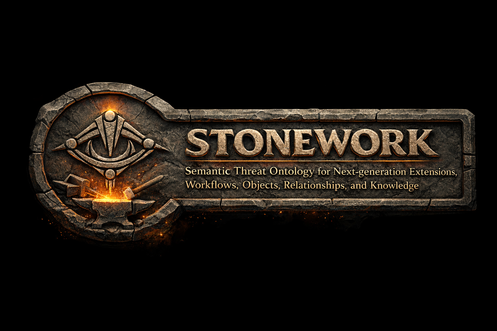

# STONEWORK — Semantic Threat Ontology for Next-generation Extensions, Workflows, Objects, Relationships, and Knowledge

**STONEWORK is an OWL 2 extension of STONES that adds what STIX 2.1 does not define.**

[STONES](https://github.com/Cyber-Terrain-Ontology/stones) provides a faithful ontological binding of STIX 2.1. STONEWORK extends that cyber terrain to cover adversary techniques, software weaknesses, and defensive controls — drawing from MITRE ATT&CK, MITRE D3FEND, CWE, NIST SP 800-53, and CIS Critical Controls. The core remains lightweight; import-only profiles compose it with the controlled vocabularies and framework mappings needed for a particular use case. Together, STONES and STONEWORK form a composable semantic stack for AI-driven cyber threat intelligence analysis.

STONEWORK is independent work. It is not affiliated with OASIS, MITRE, NIST, or CIS.

> STONEWORK is a candidate ontology for the **Cyber Ontology Foundry**, announced at STIDS 2026.

---

## Status

**v0.6.1 — Active Development**

The namespace (`https://cyberterrain.org/ns/stonework#`) is stable and will not change. Core extension vocabulary is in place. Framework coverage (ATT&CK, D3FEND, CWE, NIST SP 800-53, CIS) is expanding. The scope of coverage will grow as the ontology matures. Feedback, issues, and contributions are welcome.

---

## What STONEWORK adds

STONEWORK extends STONES across four concrete domains:

| Domain | Sources |
|---|---|
| Adversary techniques (TTPs) | MITRE ATT&CK, MITRE D3FEND |
| Software weaknesses | CWE (Common Weakness Enumeration) |
| Defensive controls | NIST SP 800-53, CIS Critical Controls |
| Vulnerability linkage | Connects CVE → CWE → ATT&CK technique → control |

This coverage enables queries that no single standard can answer on its own. A SPARQL query can trace a CVE to the weakness it exploits, to the attack patterns that leverage that weakness, to the APT groups known to use them, and to the controls that mitigate the risk — in a single federated query.

Both NIST SP 800-53 and CIS Controls now carry real, materialized `stonework:mitigatesAttackPattern` links to ATT&CK — not just conceptual coverage. NIST's crosswalk is sourced from the Center for Threat-Informed Defense's mapping, since NIST's own catalog defines no ATT&CK relationship on its own.

---

## Quick Start — Using the Ontology

### 1. Download

Choose the smallest ontology entry point that fits the use case:

```
ontologies/stonework.ttl                         # core vocabulary only
ontologies/profiles/stonework-stix.ttl           # core + categories + STIX mapping
ontologies/profiles/stonework-full.ttl           # all bundled mappings
```

STONEWORK treats STONES and the other CTI framework ontologies (ATT&CK, CAPEC, CWE, CVE, CPE, ...) as peer reference vocabularies. The profile ontologies declare a dependable import closure without adding vocabulary of their own. External framework datasets remain separately loadable peer graphs.

### 2. Load into a triplestore

Load the selected entry point and any external source datasets, such as `stones-merged.ttl` from the STONES repo, into an OWL-compatible triplestore:
[AllegroGraph](https://allegrograph.com) · [Stardog](https://stardog.com) · [GraphDB](https://graphdb.ontotext.com) · [Apache Jena / Fuseki](https://jena.apache.org)

### 3. Verify with SPARQL

```sparql
PREFIX stonework: <https://cyberterrain.org/ns/stonework#>
PREFIX owl:       <http://www.w3.org/2002/07/owl#>
PREFIX rdfs:      <http://www.w3.org/2000/01/rdf-schema#>

SELECT ?class ?label WHERE {
  ?class a owl:Class ;
         rdfs:label ?label .
}
ORDER BY ?label
```

### 4. Try the worked example

Load the CTI reference datasets (ATT&CK, CAPEC, CVE, CWE, NIST SP 800-53, CIS) and run the Log4Shell chain query: from a vulnerable product to a threat actor to a defensive control in a single SPARQL query. Full walkthrough at [cyberterrain.org](https://cyberterrain.org).

---

## Developer Setup

### Clone the repo

```bash
git clone https://github.com/Cyber-Terrain-Ontology/stonework.git
cd stonework
```

### Activate the pre-commit hook

Run these two commands once after cloning:

```bash
git config core.hooksPath .githooks
bash tools/download-rdf-toolkit.sh
```

The first command activates the hooks tracked in `.githooks/`. The second downloads the [edmcouncil rdf-toolkit](https://github.com/edmcouncil/rdf-toolkit) jar (~33 MB, gitignored) used to canonicalize Turtle files on every commit.

Run the ontology checks directly at any time with:

```bash
python3 tools/check-ontology.py
python3 tools/check-shacl.py
```

The first command parses every Turtle file and checks high-value OWL integrity rules. The second executes the SHACL profile in `ontologies/shapes/stonework-shapes.ttl` with the repository's bundled RDF4J runtime, accepting a conforming fixture and proving that a non-conforming fixture is rejected.

**What the hook does on each commit:**
- Canonicalizes all staged `.ttl` files via rdf-toolkit (alphabetical prefixes, tab indentation, consistent triple ordering) so diffs reflect content changes, not style noise
- Strips Protégé's injected default `:` prefix when present
- Parses every Turtle file and rejects common OWL integrity errors, including accidental domain/range intersections, incompatible inverse-property endpoints, property-kind collisions, class/individual punning, conflicting definitions, and duplicate controlled-vocabulary labels
- Sets `ontologies/catalog-v001.xml` read-only so Protégé cannot overwrite it

**Requirements:** Java 11+ and Python 3 on `PATH`.

---

## Documentation

| Resource | URL |
|---|---|
| Website | [cyberterrain.org](https://cyberterrain.org) |
| Ontology reference (WIDOCO) | [cyberterrain.org/ns/stonework/doc](https://cyberterrain.org/ns/stonework/doc/) |
| Namespace | `https://cyberterrain.org/ns/stonework#` |
| Base ontology | [STONES](https://github.com/Cyber-Terrain-Ontology/stones) |

### Names and aliases

Use `skos:prefLabel` for an entity's preferred human-readable name and repeat `skos:altLabel` for alternative names, pseudonyms, or spellings. `skos:altLabel` is intentionally not restricted to `stonework:Agent`: threat actors, malware, campaigns, tools, products, infrastructure, and other resources may all have alternate labels. Model a persona or account with its own identifiers and activity as a `stonework:DigitalIdentity`, not as a label.

---

## Ecosystem

**STONES + STONEWORK** form a composable semantic stack for AI-driven CTI analysis:

- **STONES** — faithful OWL 2 binding of STIX 2.1
- **STONEWORK** — extends STONES with ATT&CK, D3FEND, CWE, NIST SP 800-53, and CIS *(this repository)*

Both ontologies are candidate submissions to the **Cyber Ontology Foundry**, alongside MITRE's D3FEND Framework Ontology.

---

## Adopters

*Using STONEWORK in a project or product? Open an issue or pull request to be listed here.*

---

## License

STONEWORK is released under the **MIT License** — free to use, extend, and integrate in both open-source and commercial environments. See [LICENSE](LICENSE) for full terms.
